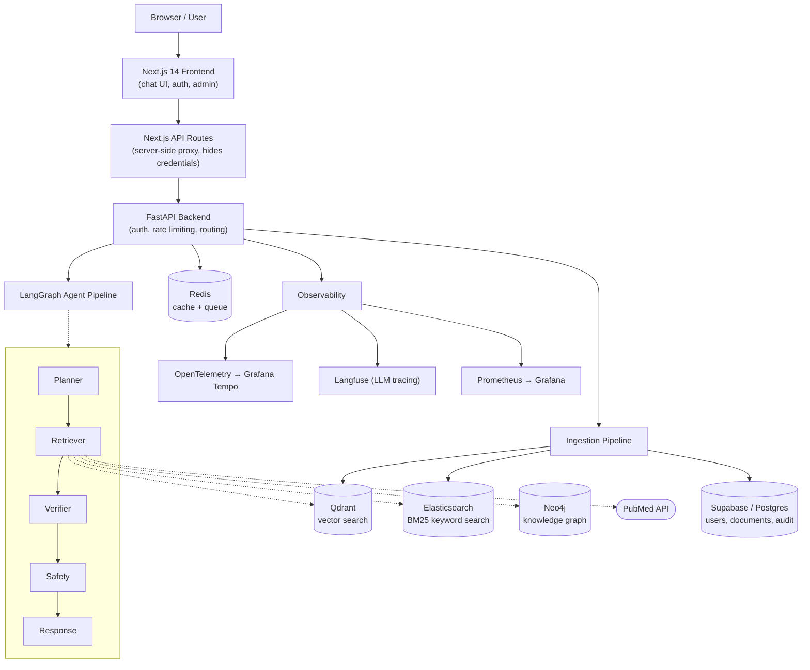
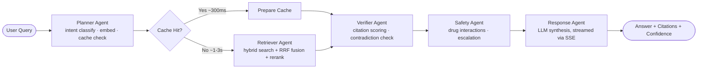

# HCIP — Healthcare Clinical Intelligence Platform

[](https://github.com/donthalamohanrao0-coder/hcip-clinical-intelligence-platform/actions/workflows/ci.yml)

A multi-tenant, agentic RAG platform that lets clinicians ask evidence-based medical
questions and get cited, safety-checked answers streamed back in real time — built on
a 5-agent LangGraph pipeline over hybrid retrieval (vector + keyword + knowledge graph).

> Built as a hands-on exploration of production RAG architecture: multi-agent
> orchestration, hybrid search, real-time streaming, and the operational details
> (auth, observability, persistence) that separate a demo from a working system.

---

## What it does

Ask a clinical question — e.g. *"What is the first-line treatment for type 2 diabetes
in a patient with CKD stage 3?"* — and the platform:

1. Classifies intent and checks a 4-layer cache for an instant answer
2. If not cached, retrieves evidence in parallel from a vector store, a keyword index,
   a medical knowledge graph, and PubMed
3. Fuses and re-ranks results, verifies citations, checks for contradictions
4. Screens for safety risks — drug interactions, emergency conditions, pediatric/
   pregnancy dosing flags — and escalates when appropriate
5. Streams the answer back token-by-token with inline citations and a confidence score

All of this is visible in real time in the UI: a stage indicator shows which agent is
currently working, then the answer types itself out like a chat assistant, with
citations, a confidence gauge, and a safety banner appearing once it's done.

## Key features

- **Multi-agent pipeline (LangGraph)** — Planner → Retriever → Verifier → Safety →
  Response, with a conditional cache-hit fast path that skips retrieval entirely (~300ms)
- **Hybrid retrieval** — dense vector search (Qdrant), BM25 keyword search
  (Elasticsearch), knowledge-graph traversal (Neo4j), and live PubMed lookups, combined
  via Reciprocal Rank Fusion and re-ranked
- **Real-time streaming chat** — Server-Sent Events stream the LLM's answer
  token-by-token, with live stage progress before generation starts
- **Multi-conversation chat sessions** — a ChatGPT-style sidebar for starting, switching
  between, and deleting conversations
- **Real authentication** — Supabase-backed users, bcrypt-hashed passwords, JWT
  sessions, and a full admin user-management UI (no demo/hardcoded accounts)
- **Safety-aware responses** — automatic detection of drug interactions, emergency
  conditions, and high-risk dosing contexts, with mandatory disclaimers and escalation
- **Full observability** — every request traced end-to-end with OpenTelemetry (Grafana
  Tempo), every LLM call logged with Langfuse, and Prometheus/Grafana dashboards for
  latency, confidence, cache-hit rate, and error metrics

## Architecture



### Agent pipeline detail



## Tech stack

| Layer | Technology | Why |
|---|---|---|
| Frontend | Next.js 14, React 18, TypeScript, Tailwind, ShadCN/Radix | Server-side API routes double as a secure proxy layer, hiding backend credentials from the browser |
| Backend | FastAPI, Pydantic, python-jose, bcrypt | Async-native — required for concurrent multi-source retrieval and SSE streaming |
| Orchestration | LangGraph, LangChain-core | Expresses the pipeline as a real state machine with conditional branching (cache-hit path) and mid-execution streaming |
| LLM | OpenAI GPT-4o-mini | Cost-effective for structured, citation-constrained synthesis at scale |
| Embeddings | BGE-M3 (self-hosted) | Free per-call, 1024-dim, strong multilingual/medical performance — avoids per-query embedding API cost |
| Vector search | Qdrant | Self-hostable, fast payload-filtered search (tenant/KB/approval-status scoping is a hard requirement) |
| Keyword search | Elasticsearch | BM25 catches exact-term matches (drug names, dosages) that dense embeddings miss |
| Knowledge graph | Neo4j | Multi-hop medical entity relationships (drug → interacts-with → drug → contraindicated-in → condition) |
| Cache & queue | Redis, Celery | 4-layer query cache (exact/semantic/retrieval/embedding) + async task queue for the full ingestion pipeline |
| Relational data | Supabase (Postgres) | Hosted Postgres with a SQL dashboard, used for users, documents, and audit logs |
| Observability | OpenTelemetry, Grafana Tempo, Langfuse, Prometheus, Grafana | Vendor-neutral tracing + LLM-specific observability + metrics, all self-hostable |
| Deployment | Docker Compose, systemd, AWS EC2 | Single-VM deployment for cost-conscious MVP; see [Roadmap](#roadmap--known-limitations) for the production target |

## Project structure

```
├── api/                  # FastAPI app — routers (auth, admin, query, ingest, health)
├── query/                # LangGraph agent pipeline (planner/retriever/verifier/safety/response)
├── ingestion/            # Document parsing, chunking, embedding, governance models
├── observability/        # OpenTelemetry, Langfuse, Prometheus wiring
├── frontend/             # Next.js app (chat UI, admin pages, API proxy routes)
├── supabase/migrations/  # SQL schema (users, documents, audit logs)
├── docker-compose.yml    # Local dev stack (Qdrant, Neo4j, Redis, Elasticsearch, Grafana...)
└── test_documents/       # Sample clinical PDFs for local testing
```

## Getting started

### Prerequisites
Docker Desktop, Python 3.10+, Node 20+, and accounts for Supabase, AWS S3, and OpenAI
(see [`CREDENTIALS_SETUP.md`](CREDENTIALS_SETUP.md) for exact steps).

### 1. Configure environment
```bash
cp .env.example .env                          # fill in your own keys
cp frontend/.env.local.example frontend/.env.local
```

### 2. Start local infrastructure
```bash
docker-compose up -d
```

### 3. Run the backend
```bash
python -m venv .venv && source .venv/bin/activate   # Windows: .venv\Scripts\activate
pip install -r requirements.txt
uvicorn api.main:app --reload
```
API docs available at `http://localhost:8000/api/docs`.

### 4. Run the frontend
```bash
cd frontend
npm install
npm run dev
```
App available at `http://localhost:3000`.

### 5. Apply the database schema
Run the SQL files in `supabase/migrations/` via the Supabase SQL Editor (in order),
then create your first admin user:
```bash
python create_admin_user.py you@example.com
```

## Roadmap / known limitations

Being upfront about what's designed-but-not-built vs. what's genuinely live:

- **No automated test suite yet** — verification so far has been manual, end-to-end
  testing against the live deployment. Unit/integration tests are the next priority.
- **Single-tenant in practice** — the multi-tenant data model (`organization_id`
  scoping) is fully implemented and enforced at every query, but only one organization
  currently exists; true multi-org onboarding isn't built.
- **Anthropic/Claude integration is not wired up** — early designs called for Claude
  to handle ingestion-time metadata extraction, but this was never implemented (no
  config field, no SDK dependency). All LLM calls today go through OpenAI.
- **No evaluation pipeline** — RAGAS/DeepEval-style automated quality scoring
  (faithfulness, citation coverage, hallucination rate) is planned but not built.
- **Single-VM deployment** — currently one EC2 instance running Docker Compose +
  systemd services. The originally-designed production target (Kubernetes, load
  balancing, autoscaling) is a deliberate later phase, not a current gap.
- **Two ingestion paths exist** — a lightweight synchronous upload endpoint (what's
  actually used) and a fuller governed/async pipeline design (`ingestion/pipeline.py`,
  Celery-orchestrated, with OCR/multi-modal parsing and a document approval workflow)
  that's implemented but not yet the live path.

## License

This is a personal portfolio/learning project, not licensed for production clinical use.
